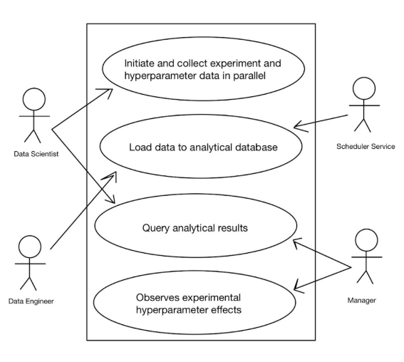
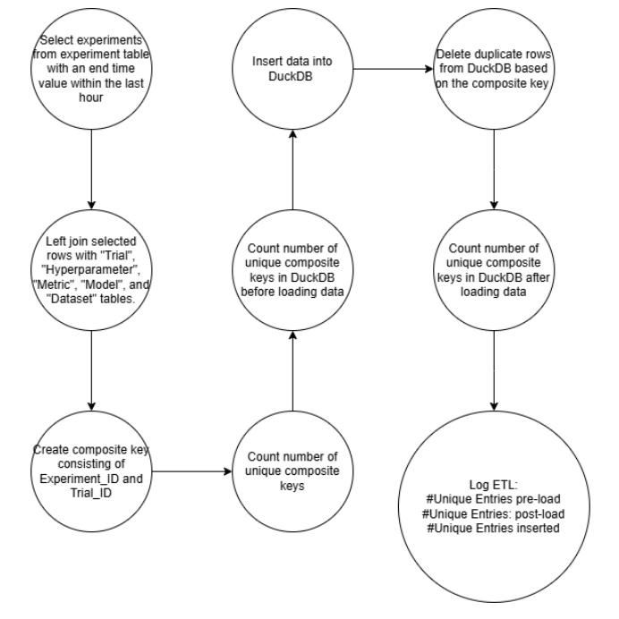
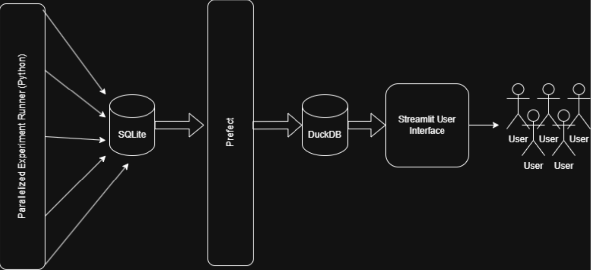
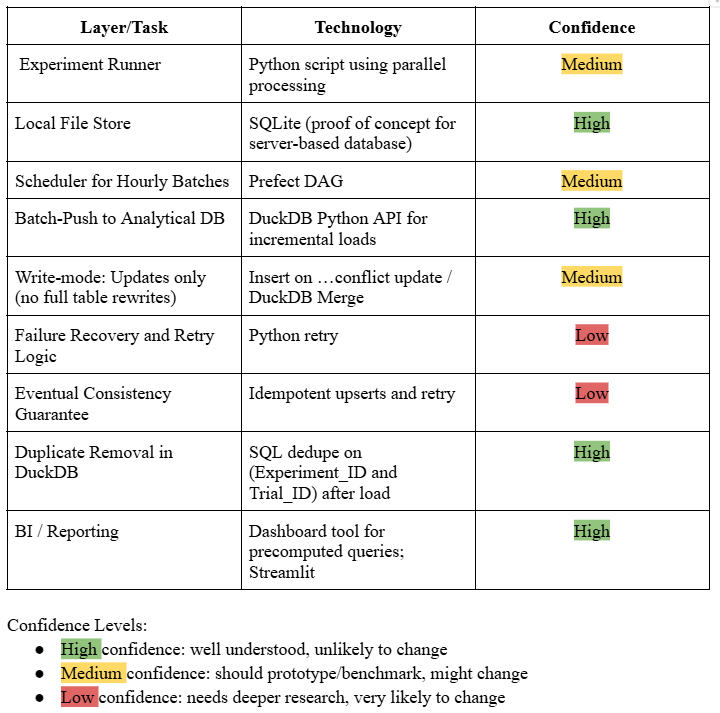
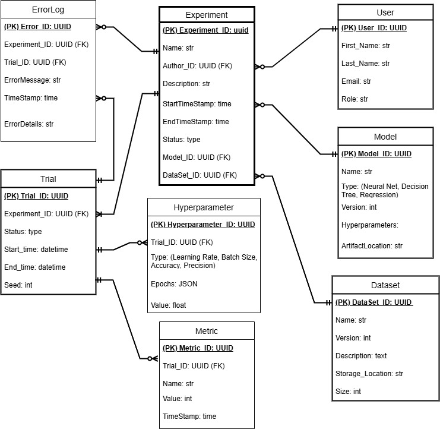

# Machine Learning Experiment Database (MLED)

## Introduction

In the development and deployment of machine learning (ML) models, maintaining a structured and comprehensive experiment tracking system is crucial. The Machine Learning Experiment Database (MLED) is designed to help data scientists and ML engineers manage, track, and analyze their experiments effectively. It captures experiment configurations, training metrics, evaluation results, and model artifacts, ensuring reproducibility, collaboration, and efficient model lifecycle management. MLED supports various ML frameworks and tools, emphasizing data integrity, scalability, compliance, a user-friendly interface, and robust querying capabilities.

## Use Case Diagram and Actors

* Data Scientist: A user who conducts experiments, tracks results, and queries the database.

* Data Engineer: A user responsible for deploying models and managing infrastructure.

* Scheduler Service: Responsible for scheduling batches

* Project Manager: Monitors project progress and make decisions based on experiment outcomes.

## Requirements

### Functional Requirements

* Must run experiment jobs in parallel across a defined hyperparameter grid
* Must record experiment outputs to the OLTP database
* Must detect new or updated records in the OLAP database since the last ETL run
* Must transfer the delta records hourly to the OLAP database for consolidated storage
* Must support retrieval of per-trial metric curves
* Must enable joins and correlation functions
* Must allow aggregation over metrics
* Must enable users to narrow down experiment results by hyperparameter criteria
* Must log ETL job metrics
* Must provide interactive visualization of results

### Non-Functional Requirements
* Shall support parallel execution scaling to utilize available CPU cores efficiently
* Shall ensure ETL jobs complete within the 1 hour window under expected data volumes
* Shall guarantee exactly one load semantics to avoid duplicates in the analytical DB
* Shall provide clear error reporting

## Literature Review
For our literature review we were encouraged to use a “deep research” tool to assist us in find relevant sources and summarizing them. To this end, we used the OpenAI ChatGPT 4o model and its deep research tool to compile our literature review. On top of using a deep research tool, part of the assignment was to select a few of the chosen sources and highlight a few areas that the LLM missed or glossed over. The papers chosen were a “Framework for Implementing Experiment Tracking in Machine Learning Development” by Abhishek Shivanna and “DuckDB: an Embeddable Analytical Database” by Mark Raasveldt.

 For the paper by Abhishek Shivanna, ChatGPT does a decent job at summarizing by telling the reader about Shivanna’s arguments and reasoning for the necessity of ML experiment tracking as well as stating what sorts of data needs to be stored (model architecture, hyperparameters, dataset version, and code versions). What ChatGPT fails to mention is that Shivanna provides, in the last half of her article, an in-depth breakdown of the ML fields that most require experiment tracking, as well as the specific aspects of each experiment that need to be tracked. For example, Shivanna rightfully states that Reinforcement Learning would benefit greatly from an experiment tracking mechanism to log data such as Episode returns and lengths, Total environment steps, Value and policy function losses, Aggregate statistics across multiple environments, Exploration strategies and their effectiveness. And Reward shaping details. Overall, though, ChatGPT does well in summarizing this paper.
 
In regard to the DuckDB paper, ChatGPT provides a good overview of why DuckDB is useful, highlighting that it runs “within the same process as the ML pipeline” and that it is essentially “SQLite for analytics”. What ChatGPT fails to mention is the more technical aspect of DuckDB such as how it is built on C/C++ as well as SQLite APIs, uses a cost-based optimizer, and a serializable MVCC concurrency control mechanism. Additionally, Raasveldt highlights the requirements for embedded analytical databases such as high efficiency for OLAP workloads, high stability, efficient transfer of tables, and embeddability in the ML process.

## System Architecture (DAG)

## Tech Stack

## Databases
SQLite
* used for logging experiments and trial metadata
* hosted on premise (proof of concept)
* no partitioning/replication
* versioning: timestamps

Duckdb
* used for interactive querying by streamlit
* hosted on premise (proof of concept), can easily be deployed using streamlit
* format: parquet like internal structure
* internal index optimization
* schema: flat tables optimized for reads

## Entity Relationship Diagram

## Parallelization
* used lock to ensure writes didn't interfere with one another
* used to test different hyperparameters
* did 2 different NN experiments and an SVM experiment
* limited on compute ability because of RL
* allowed for different hyperparameters to be tested and analyzed

## Pipeline
This project includes an automated ETL (Extract, Transform, Load) pipeline built using Prefect, designed to extract experimental data from a transactional SQLite database and load it into a DuckDB-based analytics layer. We implemented every step within the DAG. The pipeline runs every hour and ensures only new or updated experiments from the last hour are processed. Some things we had to adjust and take into consideration:

* We performed a left join of the experiments table with the author, dataset, model, trial, hyperparameter, and metric tables. We then created a large composite key from the primary keys of these tables. Using just the experiment and trial IDs as a composite key led to the deletion of valuable data when removing duplicate composite keys.

* Storing the data in a single wide table allows for faster analytical queries as all of the data we will be interested in is all in one place. By performing the joins before insertion into duckDB, we avoid performing those costly operations when performing analytical tasks.

* DuckDB is a columnar-style database, so storing the data as a single table with many columns is better for DuckDB to query efficiently.

* The denormalization of data simplifies the query logic as the user does not have to keep track of a strict 3rd Normal Form structure

## Streamlit Interface
This Streamlit interface provides a visual dashboard for exploring machine learning experiment data stored in a DuckDB database. It's designed to help researchers and practitioners analyze trials, hyperparameters, and model performance metrics in an interactive, user-friendly way.

DuckDB Integration
- Connects directly to a DuckDB .duckdb file — no CSVs or external uploads required.

Experiment Filtering
- Use sidebar filters to select and focus on specific experiments by name.

Metrics Visualization
- Line chart of selected metric values over time
- Bar chart for analyzing hyperparameter impact on performance

Model & Dataset Overview
- Shows the dataset versions and sizes used in experiments.

Schema-aware & Dynamic
- Automatically reads available tables and supports general SQL queries.

## Expected Queries
* get metrics by experiment
* metrics over time, as experiments trained
* hyperparameter analysis
* dataset audit

## Fault Tolerance
* parallel write collision: file lock on DB file
* training failure in job: try/except per trial
* DB corruption: SQLite backup/restore
* Streamlit crash: stateless reload

## Data Synchronization
Current
* write serialization is handled by filelock for SQLite to prevent concurrent write issues
* DuckDB is read only and decoupled from active training
In the Future
* use a message broker to capture environment events and coordinate asynchronous updates
* switch to a PostgreSQL or a cloud-native DB to support concurrent writes and stronger consistency gaurentees
* real-time UI updates instead of relaunching

## Data Governance
Current
* single user, single machine setup
* no role-based access control
* all data visible on streamlit regardless of user
In the Future
* integrate authentication and authorization: admin, supervisor, researcher
* implement project level resource tracking and cloud costs
* store audit logs seperately

## Limitations/Next Steps
* no cloud storage or remote deployment yet
* no automatic retraining, all initialized by users
* privacy settings to make user data available only when logged in/to supervisors
* UI currently read-only, no admin editing capabilities

## Lessons Learned
* file locking is essential for parallel DB writes
* DuckDB is a powerful analytics engine with minimal setup
* combining Streamlit and DuckDB offers low-overhead, good analytics
* separation of write/read concerns is good; SQLite for transaction writes, DuckDB for analytical reads
* schema-first logging paid off; structured schema simplified downstream querying and visualization
