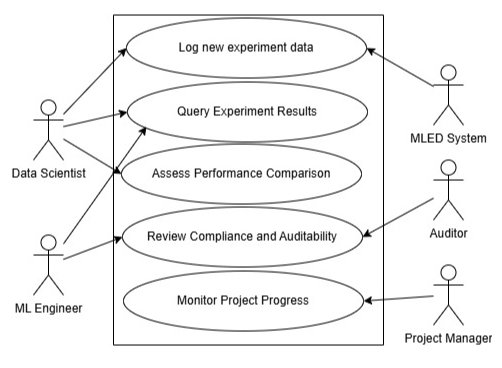

# Machine Learning Experiment Database (MLED)

## Introduction

In the development and deployment of machine learning (ML) models, maintaining a structured and comprehensive experiment tracking system is crucial. The Machine Learning Experiment Database (MLED) is designed to help data scientists and ML engineers manage, track, and analyze their experiments effectively. It captures experiment configurations, training metrics, evaluation results, and model artifacts, ensuring reproducibility, collaboration, and efficient model lifecycle management. MLED supports various ML frameworks and tools, emphasizing data integrity, scalability, compliance, a user-friendly interface, and robust querying capabilities.

## Use Case Diagram and Actors

* Data Scientist: A user who conducts experiments, tracks results, and queries the database.

* ML Engineer: A user responsible for deploying models and managing infrastructure.

* Auditor: A user who reviews experiments for compliance and reproducibility.

* MLED System: The database system that stores and manages experiment data.

* Project Manager: Monitors project progress and make decisions based on experiment outcomes.

## Use Cases

### 1. Log New Experiment Data

**Description:**  
This use case involves logging a new machine learning experiment into the MLED.

**Preconditions:**  
- The user is authenticated.  
- The system is operational.  

**Trigger:**  
- The data scientist initiates a new experiment.  

**Main Flow:**  
1. The system prompts the user to begin experimentation.  
2. The user determines their model architecture, training dataset, hyperparameters, etc.  
3. The user runs their experiment in the system interface.  
4. The system collects the experiment details.  
5. The system stores the experiment details in the database.  
6. The system generates a unique experiment ID.  
7. The system confirms successful logging.  

**Alternative Flow (Experimentation has already been conducted):**  
1. The system prompts the user to input experiment metadata.  
2. The user provides details, including dataset version, hyperparameters, and model architecture.  
3. The system validates the input.  
4. The system stores the experiment details in the database.  
5. The system generates a unique experiment ID.  
6. The system confirms successful logging.  

**Postconditions:**  
- The experiment is stored in the MLED with a unique ID.  
- The experiment details are available for querying and analysis.  

---

### 2. Query Experiment Results

**Description:**  
This use case involves querying past experiment results to compare performance metrics.  

**Preconditions:**  
- The user is authenticated.  
- The system has experiment data stored.  
- The system is operational.  

**Trigger:**  
- The user initiates a query.  

**Main Flow:**  
1. The system presents a query interface.  
2. The user specifies search criteria (e.g., experiment name, date range, performance metrics).  
3. The system processes the query.  
4. The system retrieves matching experiment records.  
5. The system displays the results to the user.  

**Postconditions:**  
- The user views the queried experiment results.  
- The user can export or analyze the results further.  

---

### 3. Review Compliance and Auditability

**Description:**  
This use case involves querying past experiment results to review for meeting regulatory requirements.  

**Preconditions:**  
- The user is authenticated.  
- The system has experiment data stored.  
- Experiment logging includes timestamps, user roles, and detailed metadata.  
- The system is operational.  

**Trigger:**  
- The auditor initiates a query.  

**Main Flow:**  
1. The system presents a query interface.  
2. The user specifies search criteria (e.g., experiment name, date range, performance metrics).  
3. The system processes the query.  
4. The system retrieves records including training data, hyperparameters, and results.  
5. The system generates a report for auditing.  

**Postconditions:**  
- The user views the queried results.  
- Experiment logs are verified as compliant or flagged for review.  

## Requirements

### Functional Requirements

* Shall log and track machine learning experiments with unique IDs.
* Shall store experiment metadata, including datasets, hyperparameters, and evaluation results.
* Shall allow users to query based on metadata, metrics, or time range.
* Shall allow users to compare past experiments.
* Shall support version control for datasets and model artifacts.
* Shall provide an interface for exporting experiment logs.
* Shall allow users to recreate experiments with the same conditions.
* Shall support multi-user access.

### Non-Functional Requirements
* Shall support scalability to handle a large number of experiments.
* Shall provide a user-friendly interface for logging and querying experiments.
* Shall maintain audit logs for compliance and reproducibility checks.
* Shall offer clear error messages and diagnostics for issues.

## Entity Relationship Diagram

